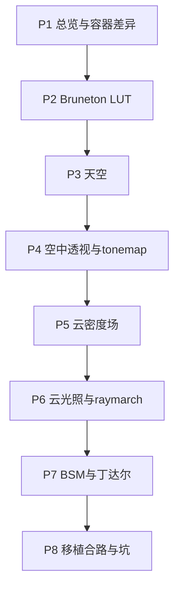

# 系列大纲（已锁定：8 篇完整版）

> 决策日期：锁定为 **8 篇完整版**。  
> 若日后精力不够，可按文末「裁剪路径」合并，但不作为默认写作计划。

## 写作原则

每篇只吃透一个问题：

1. **three-geospatial 为什么这样设计？**（读 `packages`）
2. **Cesium 侧对应成了什么？**（读 `cesium-clouds-atmosphere/src`）
3. **本篇结束时能独立画一张图 / 改一个参数并解释现象**

入口锚点：

- Cesium：`src/ThreeGeospatialPipeline.js`、`src/createCloudAtmosphere.js`
- three：`packages/atmosphere`、`packages/clouds`

## 8 篇递进关系

| # | 标题 | 学习目标（写完后你应能…） | 建议篇幅 |
|---|------|---------------------------|----------|
| **P1** | 总览：为什么是后处理管线 | 画出整条渲染顺序；说清 three Composer vs Cesium Stage | 2–3k |
| **P2** | Bruneton LUT | 解释 transmittance / scattering / irradiance 各回答什么 | 3–4k |
| **P3** | 天空渲染 | 说清天空像素 vs 几何像素；`applyGroundAtmosphere: false` | 2–3k |
| **P4** | 空中透视与 tonemap | 口述 `scene * T * sunT + inscatter`；ACES 为何只做一次 | 3–4k |
| **P5** | 体积云密度场 | 解释 coverage / shape / 多层如何叠 | 3–4k |
| **P6** | 云光照与 raymarch | 口述一步 march 循环；太阳光/天空光如何进云 | 3–4k |
| **P7** | BSM、丁达尔、地形抖动 | 画 BSM 数据流；解释 cascade 矩形与地形 depth 抖动 | 4–5k（最深） |
| **P8** | 移植合路与工程坑 | 能讲从零接线顺序；有排错清单 | 3–4k |

## 备选裁剪（仅备用，非默认）

若必须压成 5 篇：

1. P1+P2  
2. P3+P4  
3. P5+P6  
4. P7（保持完整）  
5. P8  

扩展到 10 篇时：拆 P1「坐标系」、P7「CSM / 丁达尔与地形」、P8「TAA」「LensFlare」。

## 不建议

- 按文件名流水账  
- P2 一上来啃完 Bruneton 论文全部公式  
- 把 BSM、云密度、tonemap 塞进同一篇  
