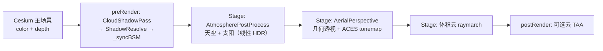

# P1｜总览：为什么是「后处理管线」，不是改 Globe shader

> 系列第 1 篇 · 目标：能画出整条渲染顺序，说清 Cesium 与 three-geospatial 的「容器」差异。  
> 对照阅读见 [reading-map.md](./reading-map.md#p1)。

---

## 1. 现象 / 你在屏幕上看到什么

启用 `createCloudAtmosphere(viewer)` 之后，画面大致是：

- 地球表面（影像 + 地形）由 **Cesium 主场景**画好，带 depth
- 天空颜色、太阳圆盘、远处雾感、体积云、云影，都是 **叠在主场景之后** 的后处理效果

如果你去改 `globe` 的 material 或 `skyAtmosphere`，会发现：**这套 Bruneton + 体积云并不走那条路**。理解「容器差异」，是整套移植的第一块砖。

---

## 2. 概念：两种「挂效果」的方式

### three-geospatial：EffectComposer 编排

原版 roughly 是：

- `CloudsEffect` 自己跑 **ShadowPass（BSM）** 和 **CloudsPass（raymarch）**
- 再把 `atmosphereShadow` / `atmosphereShadowLength` / overlay 交给 **AerialPerspectiveEffect** 合路
- 大气天空往往是另一套 Material / Effect

也就是说：**云效果主动「推」阴影数据给大气合成**。

关键文件：`packages/clouds/src/CloudsEffect.ts`（`updateAtmosphereComposition`、`shadowPass`）。

### Cesium 移植：PostProcessStage 链 + preRender 原生 GL

Cesium 没有同等的 EffectComposer 生态，本库选择：

| 能力 | 挂载方式 |
|------|----------|
| 天空 | `Cesium.PostProcessStage`（`AtmospherePostProcess`） |
| 几何空中透视 + tonemap | `Cesium.PostProcessStage`（`AerialPerspectiveEffect`） |
| 体积云 | `Cesium.PostProcessStage`（Pipeline 内嵌 cloud frag） |
| BSM / ShadowResolve | **原生 WebGL**，挂在 `scene.preRender`（Cesium Stage 不便直接画自定义 FBO 管线） |
| 云 TAA history | `scene.postRender` |

也就是说：**BSM 在主场景之后、PostProcess 之前先算好；再由 Stage 链采样同一份 shadow buffer**。

推荐入口：

```js
const pipeline = await createCloudAtmosphere(viewer);
// 内部：new ThreeGeospatialPipeline → await pipeline.init()
```

---

## 3. 实际渲染顺序（以 `init()` 为准）

> 注意：`ThreeGeospatialPipeline.js` 文件头注释里写的顺序（云 → 天空 → Aerial）与 **真正 `stages.add` 的顺序不一致**。写博文、排错时一律以 `init()` 为准。



对应代码（节选逻辑）：

1. `preRender`：`CloudShadowPass` / `ShadowResolvePass` 已在各自 `init()` 里注册；每帧 `_syncBSM()` 把 atlas / matrices 注入 Atm + Aerial  
2. `stages.add(atmosphere.stage)` — 天空打底  
3. `stages.add(aerial.stage)` — 几何空中透视 + **全屏统一 tonemap**  
4. `stages.add(cloudStage)` — 体积云叠在已 tonemap 的画面上（云 shader 内常再做一次 ACES，这是 P8 要谈的差异）  
5. `postRender`：可选 TAA 捕获  

关键构造参数：

```js
new AtmospherePostProcess(viewer, {
  renderSky: true,
  applyGroundAtmosphere: false, // 地面大气交给 Aerial，避免双重叠加
  autoAddStage: false,          // 由 Pipeline 统一决定 add 顺序
});
```

---

## 4. three 侧 vs Cesium 侧：一张对照表

| 问题 | three-geospatial | cesium-clouds-atmosphere |
|------|------------------|---------------------------|
| 谁编排整条链？ | `CloudsEffect` + 外部把 Aerial 接上 | `ThreeGeospatialPipeline` |
| 阴影纹理形态 | 多为 `sampler2DArray`（cascade 层） | **2×2 atlas 的 `sampler2D`**（Cesium Stage 限制） |
| 阴影如何到大气？ | `atmosphereShadow` 属性推送 | `_syncBSM` → `setCloudShadow` |
| 天空 / 地面大气 | 常分 Material / Effect | 两个 Stage；地面用 `applyGroundAtmosphere: false` 分流 |
| 镜头光晕 | `effects` 包多 pass | `LensFlareBloomStage` 可选，**默认不进 `init()`** |

---

## 5. 小实验（本篇必做）

在运行中的 demo（如 `cesium-advanced-learning` 的 map 页，或包自带示例）上：

1. **关掉云 Stage**  
   `pipeline.cloudStage.enabled = false`  
   → 应仍有天空 + 地面空中透视；云与部分丁达尔变弱/消失。

2. **关掉大气 Stage**  
   `pipeline.atmosphere.stage.enabled = false`  
   → 天空变「空」或只剩 Cesium 清空色；几何透视若仍开，陆地雾感可能还在。

3. **对比注释与现实**  
   打开 `ThreeGeospatialPipeline.js` 顶部注释 vs `init()` 里 `stages.add` 三行，在笔记里写一句：「文档注释曾误导我，真实顺序是 …」。

记下截图：有云 / 无云 / 无天空，方便以后写 P3、P5 当对比图。

---

## 6. 本篇遗留问题 → P2

你现在应能回答：

- 为什么不改 Globe shader？  
- BSM 为何不放在 PostProcessStage 里？  
- 天空和地面大气为何拆成两个 Stage？

尚未回答（留给后面）：

- LUT 里存了什么？（**P2**）  
- 天空像素怎么判定？（**P3**）  
- `sunT` 云影从哪来？（**P7**）

---

## 附录：建议你自己补的一张手绘

在纸上画五块盒子并编号：

1. Main scene  
2. BSM preRender  
3. Sky stage  
4. Aerial + tonemap  
5. Cloud stage  

从「主场景 depth」拉一条箭头到 Aerial 和 Cloud——后面几乎所有「抖动 / 切割 / 双重曝光」排错都会回到这张图。
