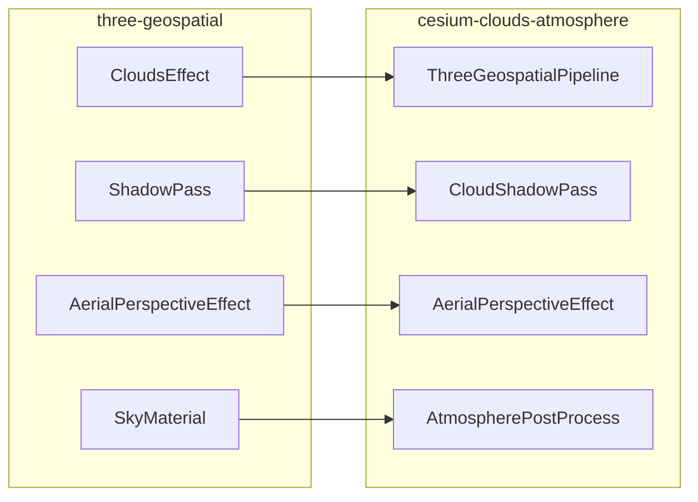

# 对照阅读清单（packages ↔ cesium-clouds-atmosphere）

路径约定：

- **Cesium** = `cesium-clouds-atmosphere/src/...`
- **three** = `three-geospatial-main/packages/...`

阅读顺序建议：**先 three（意图）→ 再 Cesium（适配）**。

---

## P1｜总览与容器差异

| 侧 | 路径 | 读什么 |
|----|------|--------|
| Cesium | [`createCloudAtmosphere.js`](../../src/createCloudAtmosphere.js) | 一行入口 |
| Cesium | [`ThreeGeospatialPipeline.js`](../../src/ThreeGeospatialPipeline.js) → `init()` | Stage 注册顺序、`preRender` `_syncBSM` |
| Cesium | [`index.js`](../../src/index.js) | 包导出边界 |
| three | [`clouds/src/CloudsEffect.ts`](../../../three-geospatial-main/packages/clouds/src/CloudsEffect.ts) | 编排、`updateAtmosphereComposition`、`shadowPass` |
| three | `atmosphere` 包 README / Aerial 与 Sky 的 composition 用法 | 原版如何把云影交给大气 |

文稿：[01-pipeline-overview.md](./01-pipeline-overview.md)

---

## P2｜Bruneton LUT

| 侧 | 路径 | 读什么 |
|----|------|--------|
| Cesium | [`AtmosphereFromThreeGeospatial/AtmosphereParameters.js`](../../src/AtmosphereFromThreeGeospatial/AtmosphereParameters.js) | bottom/top radius、散射参数、`PRECOMPUTE_CONSTANTS` |
| Cesium | [`AtmosphereFromThreeGeospatial/PrecomputedTexturesLoader.js`](../../src/AtmosphereFromThreeGeospatial/PrecomputedTexturesLoader.js) | `.bin` → Cesium Texture |
| Cesium | [`AtmosphereFromThreeGeospatial/Shaders/bruneton/`](../../src/AtmosphereFromThreeGeospatial/Shaders/bruneton/) | `definitions` / `common` / `runtime` |
| Cesium | Pipeline 内 `_getAltitudeCorrectionOffset` | 椭球 vs Bruneton 球 |
| three | `atmosphere/src/AtmosphereParameters.ts` | 同源参数 |
| three | `atmosphere/src/PrecomputedTexturesLoader.ts` | 同源加载 |
| three | `atmosphere/src/shaders/bruneton/*` | 同源 GLSL |
| three | `atmosphere/src/getAltitudeCorrectionOffset.ts`（若存在）或 Aerial 中 altitudeCorrection | 海拔校正意图 |
| three | `core/src/Ellipsoid.ts` | 椭球工具（可选） |

**小实验**：改 GUI / 参数里的 `bottomRadius`、`topRadius`。

---

## P3｜天空渲染

| 侧 | 路径 | 读什么 |
|----|------|--------|
| Cesium | [`AtmosphereFromThreeGeospatial/AtmospherePostProcess.js`](../../src/AtmosphereFromThreeGeospatial/AtmospherePostProcess.js) | 天空 Stage、`applyGroundAtmosphere`、曝光随太阳高度 |
| Cesium | [`AtmosphereFromThreeGeospatial/Shaders/sky.glsl`](../../src/AtmosphereFromThreeGeospatial/Shaders/sky.glsl) | 天空 + 太阳盘 |
| three | `atmosphere/src/SkyMaterial.ts` | 原版天空材质 |
| three | `atmosphere/src/shaders/sky.glsl` | 同源天空 shader |

**小实验**：拨 Cesium timeline 清晨/正午/傍晚；开关曝光 GUI。

---

## P4｜空中透视与 tonemap

| 侧 | 路径 | 读什么 |
|----|------|--------|
| Cesium | [`AtmosphereFromThreeGeospatial/AerialPerspectiveEffect.js`](../../src/AtmosphereFromThreeGeospatial/AerialPerspectiveEffect.js) | Stage 装配、uniforms |
| Cesium | [`AtmosphereFromThreeGeospatial/Shaders/aerialPerspectiveEffect.frag`](../../src/AtmosphereFromThreeGeospatial/Shaders/aerialPerspectiveEffect.frag) | depth 重建、`GetSkyRadianceToPoint`、ACES、`getGroundSunTransmittance`（先当黑盒） |
| Cesium | [`shaders/bundledShaders.js`](../../src/shaders/bundledShaders.js) | 发布用内联 frag（改 frag 后需 `node scripts/bundle-shaders.mjs`） |
| three | `atmosphere/src/AerialPerspectiveEffect.ts` | 原版 Effect |
| three | `atmosphere/src/shaders/aerialPerspectiveEffect.frag` | `HAS_SHADOW`、`correctGeometricError`、tonemap 位置 |

**小实验**：飞近/拉远地形，看远处雾感。

---

## P5｜体积云密度场

| 侧 | 路径 | 读什么 |
|----|------|--------|
| Cesium | [`ThreeGeospatialPipeline.js`](../../src/ThreeGeospatialPipeline.js) → `getCloudFragmentShader()` 中 weather/shape 采样 | 密度来源 |
| Cesium | Pipeline 默认 `params.layers[]` + dat.GUI 云层 | altitude/height/coverage/densityScale |
| Cesium | [`loadBinThreeGeospatial.js`](../../src/loadBinThreeGeospatial.js) | `.bin` → Data3DTexture → Cesium |
| Cesium | [`assetPaths.js`](../../src/assetPaths.js) | CDN / 本地资源 |
| three | `clouds/src/CloudLayer.ts` / `CloudLayers.ts` | 层结构 |
| three | `clouds/src/DensityProfile.ts` | 密度剖面 |
| three | `clouds/src/shaders/clouds.glsl`（采样部分） | weather/shape 采样 |

**小实验**：只开 Layer0，改 coverage / altitude。

---

## P6｜云光照与 raymarch

| 侧 | 路径 | 读什么 |
|----|------|--------|
| Cesium | [`ThreeGeospatialPipeline.js`](../../src/ThreeGeospatialPipeline.js) → cloud frag 中 march / 相函数 / 多散射 | 主循环 |
| Cesium | [`AtmosphereFromThreeGeospatial/AtmosphereForClouds.js`](../../src/AtmosphereFromThreeGeospatial/AtmosphereForClouds.js)（若使用） | 云复用 LUT |
| three | `clouds/src/CloudsMaterial.ts` | 材质与 uniforms |
| three | `clouds/src/shaders/clouds.frag` | 光照与向太阳二次 march |
| three | `clouds/src/CloudsPass.ts` | Pass 封装 |

**小实验**：调 `scatterG1/G2`、`sunIntensity`、`powderScale`。

---

## P7｜BSM、丁达尔、地形抖动

| 侧 | 路径 | 读什么 |
|----|------|--------|
| Cesium | [`CloudShadowPass.js`](../../src/CloudShadowPass.js) | CSM ortho、texel snap、2×2 atlas |
| Cesium | [`CloudShadowFrag.glsl.js`](../../src/CloudShadowFrag.glsl.js) | 太阳向 raymarch 写光学深度 |
| Cesium | [`ShadowResolvePass.js`](../../src/ShadowResolvePass.js) | temporal + variance clipping |
| Cesium | Pipeline `_syncBSM` | `setCloudShadow` / near / texelSize / geometricError |
| Cesium | `aerialPerspectiveEffect.frag` → `getFadedCascadeIndex`、`stabilizeBsmSamplePosition` | 地面云影采样 |
| three | `clouds/src/CascadedShadowMaps.ts` | cascade 几何 |
| three | `clouds/src/ShadowPass.ts`、`shaders/shadow.frag` | BSM 写入 |
| three | `clouds/src/shaders/shadowResolve.frag` | TAA resolve |
| three | `core/src/shaders/cascadedShadowMaps.glsl` | `getFadedCascadeIndex` |
| three | `atmosphere/.../aerialPerspectiveEffect.frag` | `sampleShadowOpticalDepth*` |

**小实验**：调 `shadowFar` / `shadowFadeScale` / `shadowSplitLambda`（常用约 40km / 5.0 / 1.0）。

---

## P8｜移植合路与工程坑

| 侧 | 路径 | 读什么 |
|----|------|--------|
| Cesium | Pipeline `init()` 全文 + 文件头注释 vs 真实顺序 | 文档陷阱 |
| Cesium | Atm `applyGroundAtmosphere: false` | 双重大气 |
| Cesium | Aerial ACES vs 云 frag 内 ACES | 二次 tonemap |
| Cesium | Pipeline TAA（`_taaCapture`） | 质量附录 |
| Cesium | [`LensFlareBloomStage.js`](../../src/AtmosphereFromThreeGeospatial/LensFlareBloomStage.js) | 可选，默认不挂 |
| Cesium | 根目录 [`README.md`](../../README.md) / [`LICENSE`](../../LICENSE) | 致谢与 MIT |
| three | `CloudsEffect.ts` composition | 原版推送模型 |
| three | `effects` 包 `LensFlareEffect.ts` | 多 pass 光晕对照 |

**排错清单草稿**（写 P8 时填全）：

| 现象 | 先查 |
|------|------|
| 黑屏 / 编译失败 | Stage frag、`bundledShaders` 是否过期 |
| 有云无地面影 | `_syncBSM`、`u_cloudShadowEnabled`、BSM resolve 纹理 |
| 矩形切割随相机动 | cascade UV 出界、`shadowFadeScale`、是否误用 edgeFade |
| 远处影抖动 | 地形 depth、`geometricErrorCorrectionAmount`、resolve alpha |
| 天际线闪 / 过曝 | `applyGroundAtmosphere`、ACES 次数、sky/ground 分流 |

---

## 速查：子系统 → 两边入口

